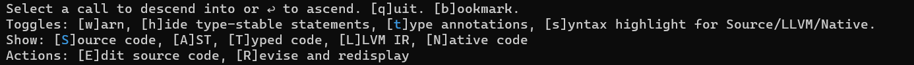
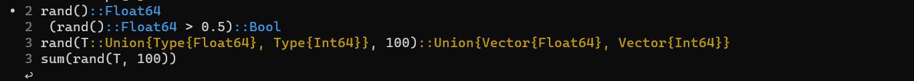

# Cthulhu.jl [](https://github.com/JuliaDebug/Cthulhu.jl/actions/workflows/CI.yml)

> *The slow descent into madness*

> [!warning]
> This package relies on internal APIs of the Julia base compiler.
> As such, its behavior may change depending on your Julia version.
> For maintenance reasons, the latest version of Cthulhu (typically managed in the `master`
> branch) does not guarantee compatibility with older Julia versions.
> Versions of Cthulhu compatible with earlier Julia releases may be maintained in dedicated branches[^old-version-branch-ex].
>
> Please refer to the `Project.toml` file for details on supported Julia versions.
> Generally, Julia's package manager automatically selects a compatible Cthulhu version for
> your Julia installation.
> If you simply want to use Cthulhu, running `pkg> add Cthulhu` will install an appropriate version.
>
> **Note for nightly users:**
> If you're using the latest Julia nightly build, we recommend regularly checking that your
> Cthulhu installation is up-to-date (`pkg> update Cthulhu`) to have compatibility with
> recent internal changes.

[^old-version-branch-ex]: For example, Cthulhu code compatible with Julia v1.10 and v1.11 is
  maintained in the [`2.16`](https://github.com/JuliaDebug/Cthulhu.jl/tree/2.16) branch.

Cthulhu can help you debug type inference issues by recursively showing the
type-inferred code until you find the exact point where inference gave up,
messed up, or did something unexpected. Using the Cthulhu interface, you can
debug type inference problems faster.

Cthulhu's main tool, `descend`, can be invoked like this:

```julia
descend(f, tt)     # function `f` and Tuple `tt` of argument types
@descend f(args)   # normal call
```

`descend` allows you to interactively explore the type-annotated source
code by descending into the callees of `f`.
Press enter to select a call to descend into, select ↩  to ascend,
and press q or control-c to quit.
You can also toggle various aspect of the view, for example to suppress
"type-stable" (concretely inferred) annotations or view non-concrete
types in red.
Currently-active options are highlighted with color; press the corresponding
key to toggle these options. Below we walk through a simple example of
these interactive features; you can also see Cthulhu v2.8 in action in
[this video](https://youtu.be/pvduxLowpPY).

## Usage: descend

```julia
function foo(x)
    T = rand() > 0.5 ? Int64 : Float64
    x + sum(rand(T, 100))
end

# option 1: use the function form to specify the signature
descend(foo, (Int,))
descend(foo, Tuple{Type{Int}})
descend(Tuple{typeof(foo), Type{Int}})
# option 2: use `@descend` with valid syntax to automatically extract the signature
@descend foo(1)
@descend foo(::Int) # 1.13+ only
```

If you do this, you'll see quite a bit of text output. Let's break it down and
see it section-by-section. At the top, you may see something like this:


This shows your original source code (together with line numbers, which here were in the REPL).
The cyan annotations are the types of the variables: `Union{Float64, Int64}` means "either a `Float64`
or an `Int64`".
Small *concrete* unions (where all the possibilities are known exactly) are generally are not a problem
for type inference, unless there are so many that Julia stops trying to work
out all the different combinations (see [this blog post](https://julialang.org/blog/2018/08/union-splitting/)
for more information).

**Note**: if the function has default positional or keyword arguments, you may see only the signature
of the function. Internally, Julia creates additional methods to fill in default arguments, which in turn call the "body" method that appears in the source text. If you're descending into one of these "default-filling" functions,
you won't be able to see types on variables that appear in the body method, so to reduce confusing the entire body is eliminated. You'll have an opportunity to descend further into the "body" method in the "call menu" described below.

In the next section you may see something like



This section shows you some interactive options you have for controlling the display.
Normal text inside `[]` generally indicates "off", and color is used for "on" or specific options.
For example, if you hit `w` to turn on warnings, now you should see something like this:


Note that the `w` in the `[w]arn` toggle is now shown in cyan, indicating that it is "on."
Now you can see small concrete unions in yellow, and concretely inferred code in cyan.
Serious forms of poor inferrability are colored in red (of which there are none in this example);
these generally hurt runtime performance and may make compiled code more vulnerable to being invalidated.

In the final section, you see:



This is a menu of calls that you can further descend into. Move the dot `•` with the up and down
arrow keys, and hit Enter to descend into a particular call. Note that the naming of calls can sometimes
vary from what you see in the source-text; for example, if you're descending into kwarg-function `foo`,
then the "body" function might be called something like `#foo#123`.

Any calls that are made at runtime ([dynamic dispatch](https://en.wikipedia.org/wiki/Dynamic_dispatch)) cannot be descended into;
if you select one, you'll see

```
[ Info: This is a runtime call. You cannot descend into it.
```

and the call menu will be printed again.

Calls that start with `%nn = ...` are in Julia's internal
[Abstract Syntax Tree (AST)](https://docs.julialang.org/en/v1/devdocs/ast/) form;
for these calls, Cthulhu and/or [TypedSyntax](TypedSyntax/README.md) (a sub-package living inside the Cthulhu repository) failed to "map" the call back to the original source code.

## Caveats

As a word of warning, **mapping type inference results back to the source is hard, and there may be errors or omissions in this mapping**. See the [TypedSyntax README](TypedSyntax/README.md) for further details about the challenges. When you think there are reasons to doubt what you're seeing, a reliable but harder-to-interpret strategy is to directly view the [`[T]yped code`](#viewing-the-internal-representation-of-julia-code) rather than the `[S]ource code`.

For problems you encounter, please consider filing issues for (and/or making pull requests to fix) any failures you observe. See [CONTRIBUTING.md](CONTRIBUTING.md) for tips on filing effective bug reports.


## Methods: descend

- `@descend_code_typed`
- `descend_code_typed`
- `@descend_code_warntype`
- `descend_code_warntype`
- `@descend`: Shortcut for `@descend_code_typed`
- `descend`: Shortcut for `descend_code_typed`

## Usage: ascend

Cthulhu also provides the "upwards-looking" `ascend`. While `descend` allows
you to explore a call tree starting from the outermost caller, `ascend`
allows you to explore a call chain or tree starting from the innermost
callee. Its primary purpose is to support analysis of invalidation and inference
triggers in conjunction with [SnoopCompile](https://github.com/timholy/SnoopCompile.jl),
but you can use it as a standalone tool.
There is a [video using ascend to fix invalidations](https://www.youtube.com/watch?v=7VbXbI6OmYo),
where the part on `ascend` starts at minute 4:55.

For example, you can use it to examine all the inferred callers of a method instance:

```julia
julia> m = which(length, (Set{Symbol},))
length(s::Set) in Base at set.jl:55

julia> mi = m.specializations[1]      # or `mi = first(Base.specializations(m))` on Julia 1.10+
MethodInstance for length(::Set{Symbol})

julia> ascend(mi)
Choose a call for analysis (q to quit):
 >   length(::Set{Symbol})
       union!(::Set{Symbol}, ::Vector{Symbol})
         Set{Symbol}(::Vector{Symbol})
         intersect!(::Set{Union{Int64, Symbol}}, ::Vector{Symbol})
           _shrink(::typeof(intersect!), ::Vector{Union{Int64, Symbol}}, ::Tuple{Vector{Symbol}})
             intersect(::Vector{Union{Int64, Symbol}}, ::Vector{Symbol})
       union!(::Set{Symbol}, ::Set{Symbol})
         union!(::Set{Symbol}, ::Set{Symbol}, ::Set{Symbol})
           union(::Set{Symbol}, ::Set{Symbol})
```
You use the up/down arrows to navigate this menu, enter to select a call to
`descend` into, and your space bar to toggle branch-folding. `ascend(mi; pagesize=20)`
allows you to show up to 20 lines at once.

It also works on stacktraces. If your version of Julia stores the most recent error in the global `err` variable, you can use

```julia
julia> using Cthulhu

julia> sqrt(-1)
ERROR: DomainError with -1.0:
sqrt will only return a complex result if called with a complex argument. Try sqrt(Complex(x)).
Stacktrace:
 [1] throw_complex_domainerror(f::Symbol, x::Float64)
   @ Base.Math ./math.jl:33
 [2] sqrt
   @ ./math.jl:677 [inlined]
 [3] sqrt(x::Int64)
   @ Base.Math ./math.jl:1491
 [4] top-level scope
   @ REPL[1]:1

julia> ascend(err)
Choose a call for analysis (q to quit):
 >   throw_complex_domainerror(::Symbol, ::Float64) at ./math.jl:33
       sqrt(::Int64) at ./math.jl:1491
```

If this isn't available to you, a more "manual" approach is:

```julia
julia> bt = try
           [sqrt(x) for x in [1, -1]]
       catch
           catch_backtrace()
       end;

julia> ascend(bt)
Choose a call for analysis (q to quit):
 >   throw_complex_domainerror(::Symbol, ::Float64) at ./math.jl:33
       sqrt at ./math.jl:582 => sqrt at ./math.jl:608 => iterate at ./generator.jl:47 => collect_to! at ./array.jl:710 => collect_to_with_first!(::Vector{Float64}, ::Float64, ::Base.Generator{Vector{Int64}, typeof(sqrt)}, ::Int64) at ./array.jl:688
         collect(::Base.Generator{Vector{Int64}, typeof(sqrt)}) at ./array.jl:669
           eval(::Module, ::Any) at ./boot.jl:360
             eval_user_input(::Any, ::REPL.REPLBackend) at /home/tim/src/julia-master/usr/share/julia/stdlib/v1.6/REPL/src/REPL.jl:139
...
```

The calls that appear on the same line separated by `=>` represent inlined methods; when you select such a line,
you enter at the final (topmost) call on that line.

Using Cthulhu may be particularly useful for `MethodError`s, since those exist purely in the type-domain.

By default,
- `descend` views non-optimized code without "warn" coloration of types
- `ascend` views non-optimized code with "warn" coloration

You can toggle between these with `o` and `w`.

## Combine static and runtime information

Cthulhu has access only to "static" type information, the same information available to the Julia compiler and type inference.
In some situations, this will lead to incomplete or misleading information about type instabilities.

Take for example:
```julia
using Infiltrator: @infiltrate
using Cthulhu: @descend
using Base: @noinline # already exported, but be explcit

function foo(n)
    x = n < 2 ? 2 * n : 2.5 * n
    y = n < 4 ? 3 * n : 3.5 * n
    z = n < 5 ? 4 * n : 4.5 * n
    # on Julia v1.6, there is no union splitting for this number of cases.
    bar(x, y, z)
end

@noinline function bar(x, y, z)
    string(x + y + z)
end
```

Then invoke:

```julia
Cthulhu.@descend foo(5)
```

Now, descend into `bar`: move the cursor down (or wrap around by hitting the up arrow) until
the dot is next to the `bar` call:

```
 ⋮
   4  (4.5 * n::Int64)::Float64
 • 6 bar(x, y, z)
   ↩
```

and then hit Enter. Then you will see the code for `bar` with its type annotations.

Notice that many variables are annotated as `Union`.
To give Cthulhu more complete type information, we have to actually run some Julia code. There are many ways to do this. In this example, we use [`Infiltrator.jl`](https://github.com/JuliaDebug/Infiltrator.jl).

Add an `@infiltrate`:

```julia
function foo(n)
    x = n < 2 ? 2 * n : 2.5 * n
    y = n < 4 ? 3 * n : 3.5 * n
    z = n < 5 ? 4 * n : 4.5 * n
    # on Julia v1.6, there is no union splitting for this number of cases.
    @infiltrate
    bar(x, y, z)
end

@noinline function bar(x, y, z)
    string(x + y + z)
end
```

Now invoke `foo` to get REPL in the scope just before `bar` gets called:

```julia
julia> foo(4)
Infiltrating foo(n::Int64) at ex.jl:10:

infil>
```

Enter `@descend bar(x, y, z)` you can see that, for `foo(4)`, the types within `bar` are fully inferred.

## Viewing the internal representation of Julia code

While Cthulhu tries to place type-annotations on the source code, this obscures
detail and can occassionally go awry (see details [here](TypedSyntax/README.md)).
For anyone who needs more direct insight, it can be better to look directly at Julia's
internal representations of type-inferred code.
Looking at type-inferred code can be a bit daunting initially, but you grow more
comfortable with practice. Consider starting with a
[tutorial on "lowered" representation](https://juliadebug.github.io/JuliaInterpreter.jl/stable/ast/),
which introduces most of the new concepts. Type-inferrred code differs from
lowered representation by having additional type annotation.
Moreover, `call` statements that can be inferred are converted to `invoke`s
(these correspond to static dispatch), whereas dynamic dispatch is indicated by the
remaining `call` statements.
Depending on whether you're looking at optimized or non-optimized code,
it may also incorporate inlining and other fairly significant transformations
of the original code as written by the programmer.

This video demonstrates Cthulhu for viewing "raw" type-inferred code:
[Watch on YouTube](https://www.youtube.com/watch?v=qf9oA09wxXY)
[](https://www.youtube.com/watch?v=qf9oA09wxXY)

The version of Cthulhu in the demo is a little outdated, without the newest features,
but may still be relevant for users who want to view code at this level of detail.


## Customization

The default configuration of toggles in the `@descend` menu can be customized
with `Cthulhu.CONFIG` and persistently saved (via Preferences.jl) using
`Cthulhu.save_config!()`:

```julia
julia> Cthulhu.CONFIG.enable_highlighter = true # Change default
true

julia> Cthulhu.save_config!(Cthulhu.CONFIG) # Will be automatically read next time you `using Cthulhu`

julia> Cthulhu.save_config!(Cthulhu.CONFIG; force = true) # to overwrite any existing preferences
```

## Development

If you intend to Revise changes made to Cthulhu, it is strongly advised to disable the Compiler extension by uncommenting it from the `Project.toml` while iterating.
Otherwise, the Compiler extension will be unconditionally loaded, and Revise seems to fail to revise the changes into `CthulhuCompilerExt`.
